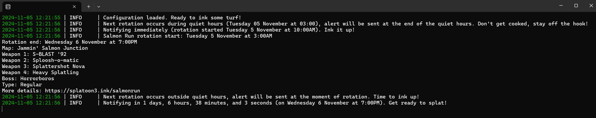
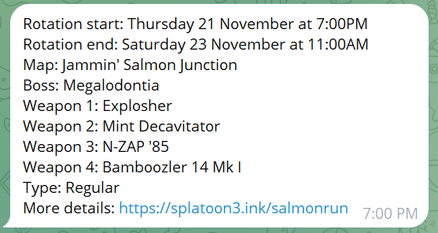

# 🎮 Salmon Run Notifier 🐟

Welcome to the **Salmon Run Notifier**! This Python script fetches the current and upcoming Salmon Run schedules from Splatoon 3 and sends notifications using the Apprise library. It ensures you never miss a Salmon Run rotation by providing timely alerts. 🎉

## 📑 Table of Contents

- [✨ Features](#features)
- [📋 Requirements](#requirements)
- [🛠️ Installation and usage](#installation-and-usage)
- [⚙️ Configuration](#configuration)
- [📜 Logging](#logging)
- [🛡️ Error Handling](#error-handling)
- [🤝 Contributing](#contributing)

## Examples



## Features

- Fetches current and upcoming Salmon Run schedules.
- Sends notifications using Apprise.
- Handles errors gracefully and retries on failure.
- Notifies if there are consistent failures for more than a specified threshold.
- Configurable quiet hours to avoid notifications during your beauty sleep. 😴

## Requirements

### Windows exe:
- No requirements

### Docker container:
- Docker

### Python package
- Python 3.13
- `apprise` library
- `requests` library
- `python-dateutil` library
- `loguru` library

## Installation and Usage

### Option 1: Windows binary
1. Download the latest exe [releases](/releases/latest/download/asset-name.zip) 
2. Run the exe


### Option 2a: Using Poetry
1. Clone the repository:
    ```sh
    git clone https://github.com/NaruZosa/salmon-run-notifier.git
    cd salmon-run-notifier
    ```

2. Install the required libraries:
    ```sh
    pip install -r requirements.txt
    ```

3. Run the program to generate a configuration file, edit the configuration (see below) and run again:
    ```sh
    poetry run python -m main
    ```


### Option 2a: Using pip
1. Clone the repository:
    ```sh
    git clone https://github.com/NaruZosa/salmon-run-notifier.git
    cd salmon-run-notifier
    ```
   
2. Install the required libraries:
    ```sh
    pip install poetry
    poetry install --without dev
    ```

3. Run the program to generate a configuration file, edit the configuration (see below) and run again:
    ```sh
    python -m main
    ```


### Option 3a: Using Docker Compose with remote image

1. Create a `compose.yaml` file with the following content:
    ```yaml
    services:
      salmon_run_notifier:
        image: ghcr.io/naruzosa/salmon-run-notifier:latest
        volumes:
          - C:\Your\Path\config:/app/config   <- Replace the path on the left with your path
        environment:
          - PYTHONUNBUFFERED=1
    ```

2. Run the program using Docker Compose to generate a configuration file, edit the configuration (see below) and run again::
    ```sh
    docker compose up
    ```


### Option 3b: Using Docker Compose with local build fallback

1. Clone the repository:
    ```sh
    git clone ghcr.io/naruzosa/salmon-run-notifier:latest
    cd salmon-run-notifier
    ```

2. Run the program using Docker Compose to generate a configuration file, edit the configuration (see below) and run again::
    ```sh
    docker compose up
    ```


## Configuration


On first run, a `salmon_config.toml` file will be generated in the `config` folder with the following content:

```toml
# Salmon Run Notifier Configuration File

[settings]
# The local timezone for the notifier (e.g., "America/New_York")
local_timezone = "Your/Timezone"

# The start hour of the quiet period (0 = midnight)
alert_quiet_start = 0  # Midnight

# The end hour of the quiet period (10 = 10 AM)
alert_quiet_end = 10  # 10 AM

# The Apprise notification paths in a list (e.g., ["tgram://<token>/<chat_id>"])
apprise_paths = ["tgram://your_telegram_token/your_chat_id"]

# The API endpoint for fetching Salmon Run schedules
schedules_api = "https://splatoon3.ink/data/schedules.json"

# The number of hours to wait before notifying of consistent failures
failure_threshold_hours = 6  # 6 hours

# Whether to use a simpler console logger and silence DEBUG (example: "2024-11-04 23:28:43 | INFO     | _Configuration loaded. Ready to ink some turf!" instead of "2024-11-04 23:28:43.405 | INFO     | __main__:load_config:75 - Configuration loaded. Ready to ink some turf!")
simple_console_logger = true
```

Adjust this file as needed. The only setting that must be adjusted is `apprise_paths`.
For information on Apprise paths, refer to [their wiki](https://github.com/caronc/apprise/wiki).

## Logging

The script uses the `loguru` library for logging. It logs debug information, errors, and notifications to help trace the flow of the program and identify issues.

## Error Handling

The script includes robust error handling to manage exceptions during API calls, schedule processing, and notification sending. It retries on failure and notifies if there are consistent failures for more than 6 hours.

## Dependencies
This project uses [Apprise](https://github.com/caronc/apprise), [Loguru](https://github.com/Delgan/loguru) and [Requests](https://github.com/psf/requests) and the [splatoon3.ink API](https://splatoon3.ink) 

## Contributing

Contributions are welcome! Please fork the repository and submit a pull request with your changes. Let's make sure no Inkling or Octoling misses a (good) Salmon Run rotation ever again! 🦑

---

Feel free to reach out if you have any questions or need further assistance. Happy Salmon Running! 🐟🎮